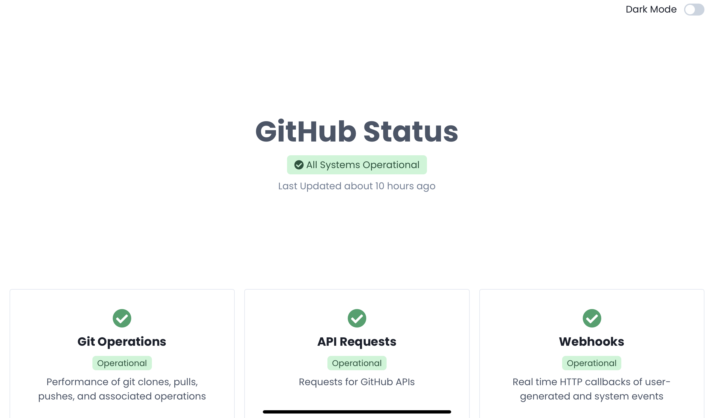

# github-status



[](https://github.com/semantic-release/semantic-release)
[](http://commitizen.github.io/cz-cli/) 

An alternative take on how github status page should look!

Based on the app-ideas repository: https://github.com/florinpop17/app-ideas/blob/master/Projects/1-Beginner/GitHub-Status-App.md

## Development

Start up the docker development container:

```
./run-docker-development.sh
```

Then you can run any of the scripts below.

### Available Scripts

In the project directory, you can run:

#### `yarn start`

Runs the app in the development mode.\
Open [http://localhost:3000](http://localhost:3000) to view it in the browser.

The page will reload if you make edits.\
You will also see any lint errors in the console.

#### `yarn build`

Builds the app for production to the `build` folder.\
It correctly bundles React in production mode and optimizes the build for the best performance.

The build is minified and the filenames include the hashes.\
Your app is ready to be deployed!

See the section about [deployment](https://facebook.github.io/create-react-app/docs/deployment) for more information.

#### `yarn lint` / `yarn lint:fix`

Runs eslint to check for strict typescript lint errors.\
Run `yarn lint:fix` to attempt to fix any issues.

#### `yarn ts` / `yarn ts-watch`

Runs the typescript compiler (in watch mode with the latter command).\
Running the development server also compiles typescript.

## Learn More

You can learn more in the [Create React App documentation](https://facebook.github.io/create-react-app/docs/getting-started).

To learn React, check out the [React documentation](https://reactjs.org/).

## Super Linter

For all other linters, run the super lint docker container to check for errors:

```
./run-super-linter.sh
```
